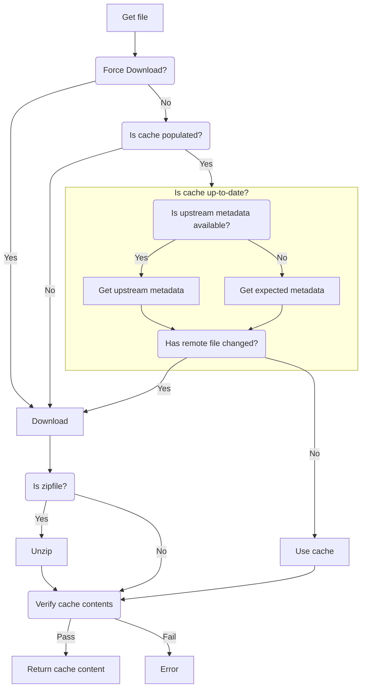

# Managing file downloads

This file is an attempt to capture some of the logic around when to download a
file, with sensible caching, idempotency, file verification, etc.



# Caching

- When a remote file is requested, first an attempt is made to retrieve it from
  a local cache.
- If the file is not available then it should be downloaded and a copied stored
  in the cache.
- If the user specifies a "force" option, then the file should be downloaded and
  the relevant part of the cache should be overwritten, irrespective of the
  cache's prior contents.

# File integrity verification

When returning file contents, it may be appropriate to check the integrity of
the file, to guard against truncation or corruption during download and storage
in cache. Some examples include:

- checksum (sha256 or similar)
- filesize
- number of records?

For the purpose of ensuring file integrity, these metadata could itself be
cached, provided there is a suitable mechanism for keeping this metadata cache
up-to-date. Alternatively the metadata could be retrieved on demand.

## Detecting whether an upstream file has changed (without re-downloading)

It may be possible to programmatically detect whether the cache contents is
stale. The contents of the cache can be compared with some metadata about the
file. The metadata might be available from the upstream source - assuming that
the cost of re-downloading the whole file is high, but downloading the relevant
metadata is low. Eg:

- checksum (sha256 or similar)
- last update timestamp
- filesize

Examples:

- Geofabrik (md5 hash value is stored in a separate file to the main download)
  https://download.geofabrik.de/europe/great-britain/
- Wikidata (timestamp and filesize)
  https://dumps.wikimedia.org/wikidatawiki/entities/ (See Wikidata example in
  https://github.com/andrewphilipsmith/station-to-station/blob/feature/auto-download-resources/get_resources.ipynb)

The only feasible local metadata data, could be timestamp based, for cases where
the data is expected to change on a regular basis (eg )

```pseudocode
age = now() - time_stamp_of_cache_content()
if age > expected_refresh_interval:
    re_download_cache_contents()
```

Using a checksum or filesize from a local metadata cache does not help assert
that the cache contents is fresh, as the metadata cache itself may be stale.

# Preprocessing data

Some dataset have time-dependant data embedded. This will need to be filtered
prior to comparing checksums.
