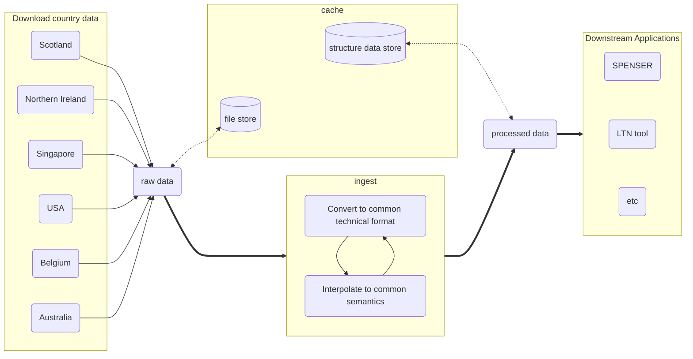

# Draft flow diagram

This is a concept diagram for the flow of data through the system. It is not
complete nor authoritative. It is intended to be a starting point for
discussion.

TODO:

- Add details about the ingest process
- Highlight components/functionality that we are likely to need to implement
  ourselves.
- Highlight components/functionality that which could be adopted from a
  third-party pipeline management tool (e.g. Airflow, Dagster, etc).
- Improve layout and styling (e.g. the position of the cache box is not ideal).

